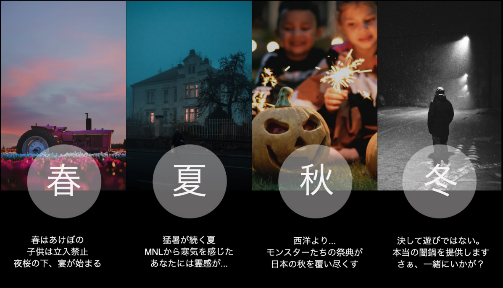
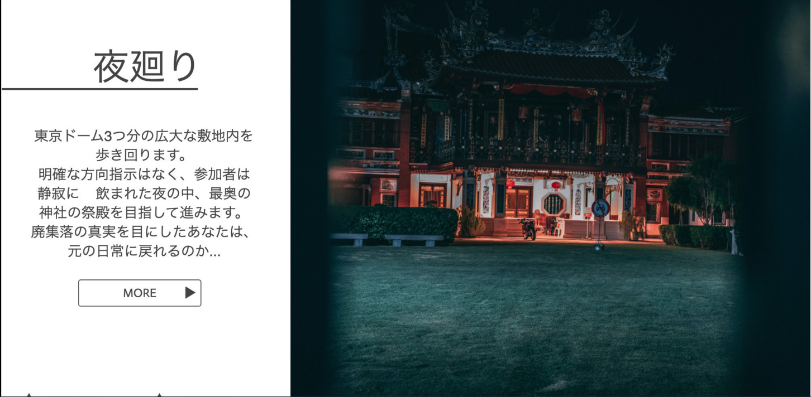

<html>
  
  <link rel="stylesheet" type="text/css" href="attraction.css">
  
  <body>
  
  季節にあわせたアトラクション
    
  
  

  
    

    
   

 
    
   

    
   

  
  
  
 
  
　 このホームページは、ソフトウェア工学の授業の一環で作成されたものでありフィクションです。
  
  

   
  </body>
  
</html>
